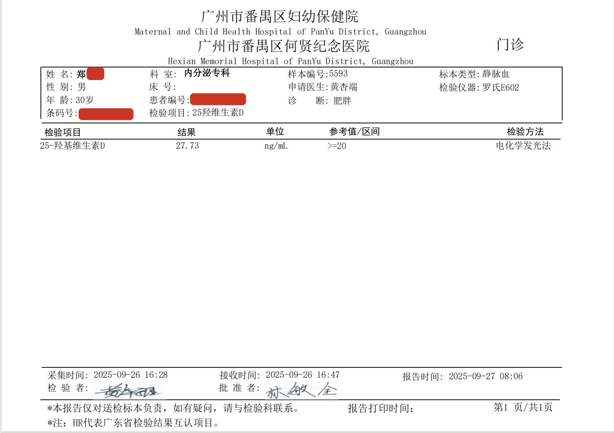
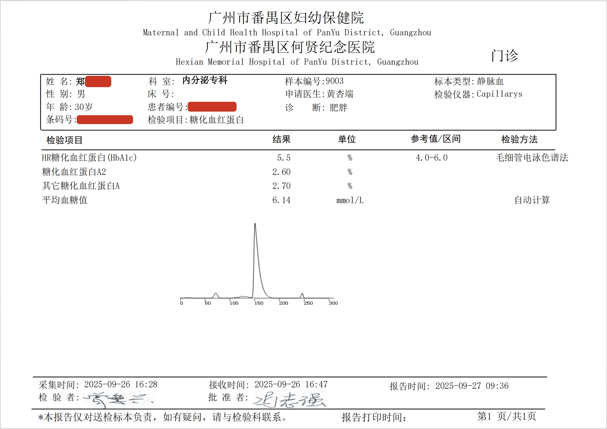
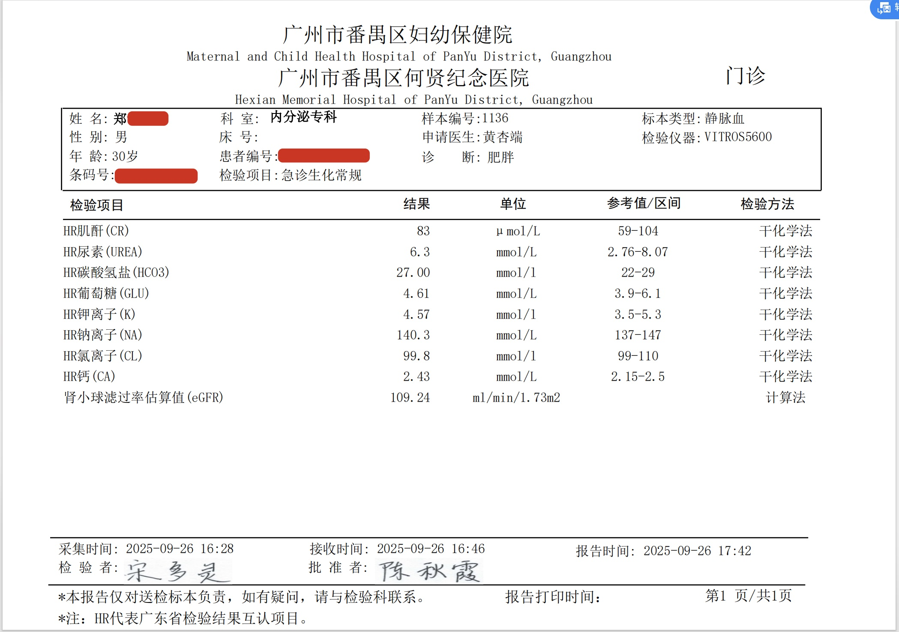
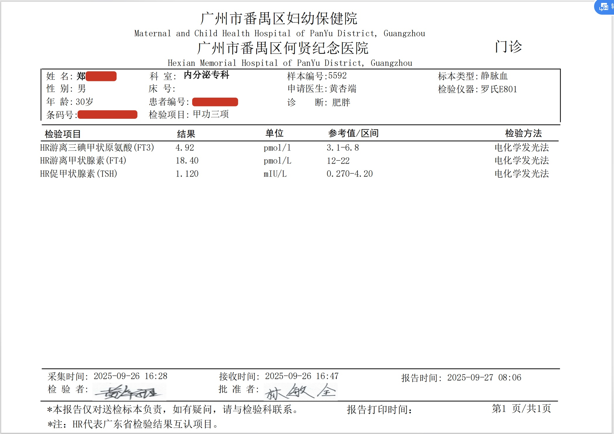
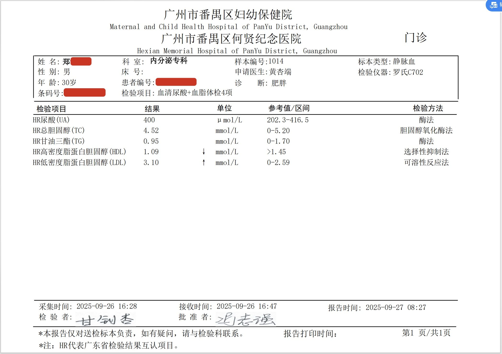

# 我每天摄入的补剂清单

## 镁
240mg/每天，吃 甘氨酸镁。

## 锌
12.5毫克/天。吃 吡啶甲酸锌。

## 铁
每周吃 2 次猪肝，每次 50 克。或者其他肝脏也行，鸡肝，牛肝，羊肝。   
“每周不超过2次，每次50克”的频率和份量，是一个非常关键的、能确保安全的限制。绝对不宜再增加频率或份量。

## 维生素 D3
每天 2500 IU，读者应当查 "25-羟基维生素D"，保持在 40-60ng/ml。

</img>

## 维生素 K2 (Menaquinone-7, MK-7)
D3促进身体对钙的吸收，而K2则负责将这些钙引导到正确的地方——骨骼和牙齿，而不是沉积在血管和软组织中，从而预防动脉钙化。如果您在补充较高剂量的D3，补充K2就尤为重要。

常见剂量：每天 90-120 微克 (mcg)

## Omega-3 脂肪酸 (EPA & DHA)
常见剂量：建议选择高品质鱼油，每天摄入 1-2 克 (g) 的 EPA+DHA 组合总量

## B族维生素 (B-Complex)
B族维生素是一个大家庭（B1, B2, B3, B5, B6, B7, B9, B12）. 
它们是身体能量代谢的“火花塞”，将我们吃的食物转化为能量。压力大、饮酒、饮食不均衡的人群容易缺乏。特别是B12对神经系统和预防贫血至关重要，B6也与情绪和睡眠调节有关。  

常见形式：直接选择优质的“复合B族维生素 (B-Complex)”补充剂通常比单一百分补充更均衡、更方便。建议选择含有活性形式的B族维生素（如B9叶酸用5-MTHF，B12用甲钴胺）。

## 蛋白粉
30g（一勺）约等于 20 多克的蛋白质。  

## 肌酸（一水肌酸）
每天 3-5 克

# 免责声明：本文章的信息仅供参考
每个人的身体情况不同，此处的信息仅代表我的个人情况，仅供参考。本人无法对读者瞎吃补剂造成的后果负责。  

信息来源： 
1. AI 模型：Gemini 2.5 Pro
2. 网上查阅的其他资料

## 体检数据（仅供参考）
基本数据：
- 姓名：郑*
- 年龄：30岁（出生于 1995 年）
- 性别：男
- 身高：165cm
- 体重：80kg

## 糖化血红蛋白 （检测时间：2025年9月26号）

## 急诊生化常规 （检测时间：2025年9月26号）

## 甲功三项 （检测时间：2025年9月26号）

## 血清尿酸+血脂体检4项 （检测时间：2025年9月26号）
